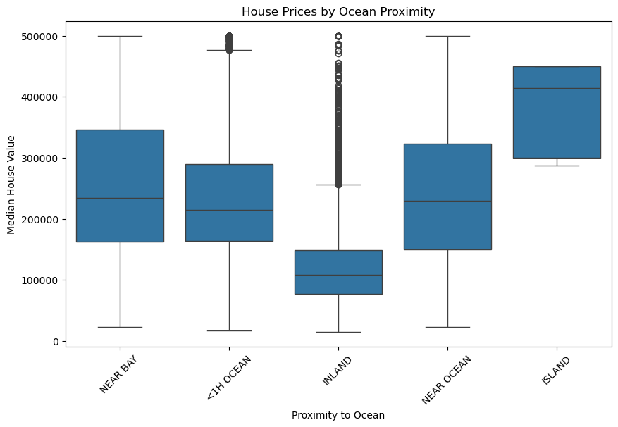

# Project_1_G2
Project 1 / Python

Code Citations and Assistance Include: Student Collaboration & Xpert Learning Assistant Chat+/ChatChpt

Student Names: Kimberly Wessler, JaJuan Graham, Christian Pena, Christine Espiritu, Kris De La Fuente

Title: What Drives The California Housing Market

California Housing Prices Citations - Kaggle - (https://www.kaggle.com/datasets/shibumohapatra/house-price?resource=download):

Description: Housing data shows various metrics, such as population, median income, and median housing prices. The analysis will be run on the following categories: 

1)Housing Market Insights (Cristian):
 Which areas have the highest and lowest housing prices? -- Use longitude and latitude to map locations with extreme values.

 
I first made a correlation heatmap to investigate the connections between the dataset's attributes. Since more expensive homes are typically found in higher-income areas, the correlation between median income and median house value is among the greatest. Additionally, because they usually scale together in residential premises, the total number of rooms, bedrooms, and households have a strong correlation. It's interesting to note that geographic variables like latitude and longitude also exhibit correlations with pricing trends, suggesting that prices are location-based.

 
 Next, I examined how proximity to the ocean affects housing prices using a box plot. Properties near or within an hour of the ocean have significantly higher median values compared to inland properties. Inland homes are the most affordable, with a consistent price range. Interestingly, properties in the ‘Island’ category show a wider price range, possibly indicating a mix of exclusive, high-priced properties.
 
2)Geographical Questions (Kimberly):
 Are areas closer to the bay more densely populated? -- Compare population and households for areas near the bay. --How does population density impact housing affordability?

 
 This boxplot shows the distribution for the populations for the areas grouped by their proximity to the ocean. We can see that the Island areas have a significantly lower and more consistent size across all of their locations. Areas near the ocean, bay, and inland show greater variability, with some areas within those regions having very high populations, which is indcated by the outliers. The outliers suggest some highly populated areas within the near ocean, near bay, and inland categories. The median population is fairly similar across most categories, suggesting similar central tendencies.

This bar chart shows the household to population ratio according to each ocean proximity group. We can see that the Island group has a household to population ratio of 2.42 people to each household and the number of people per household increases slightly as you get further away from the ocean. However, the differnce between the lowest ratio band the greatest ratio is less than half a person. It does not seem like the proximity to the ocean makes a significant difference in the population density. 

3)Demographics and Households (JaJuan): Which areas have the highest population density? -- Analyze areas with high population and low total_rooms.

Latitude 38.32, Longitude -121.98 (Inland) – Extremely high population density (392.63 people per room).

Latitude 40.41, Longitude -120.51 (Inland) – Population density of 116.61.

Latitude 35.32, Longitude -120.70 (Near Ocean) – Population density of 55.36.

Latitude 38.69, Longitude -121.15 (Inland) – Population density of 27.81.

Latitude 34.47, Longitude -118.59 (Inland) – Population density of 16.23.

The highest density of the location appears to be near Sacramento, California.
Lowest density the location in Lancaster, California.

Housing costs are more expensive in high-population-density areas.
Low-density areas are more rural and less populated.
Also, income is moderate in highly populated dense areas.
Housing age- 29 years with a mix of older homes and newer developments. Income ranges from low (0) to high (15), with an average of 4, and higher salaries are associated with wealthier areas.
Many red dots around Los Angeles, San Diego, and Orange County, Indicate high housing density.

4)Economic and Income Analysis (Christine): Are high-income areas associated with newer homes?
 
 This graph reveals no correlation between the age of housing and the income level of an area. The data demonstrates that higher-income areas are not necessarily populated with newer homes, indicating that housing age is not a reliable indicator of income.

 

5)Predictive Questions (Kris): 
 What areas are likely to have increasing house values based on current trends? -- Explore how income, population, and proximity to the ocean might drive future prices.

My analysis provides an in-depth look at the California housing market through predictive modeling and data visualization. I used a scatter plot overlaid on a map of California, highlighting costlier areas in red to reveal key pricing patterns. This visualization exposes important insights, such as the impact of ocean proximity on home values and price fluctuations as we move inland, demonstrating that housing trends vary across regions.
While proximity to the ocean correlates with higher home prices, it is not the only driving factor. Median income plays a significant role in determining housing costs in different areas, suggesting that economic conditions may outweigh location-based factors in certain regions.

